# Implementation Guide

## Objetivo

Este documento descreve o processo completo de implementação da arquitetura AWS utilizada para hospedar a aplicação Toggle Master.

## Arquitetura Implementada

A solução foi construída utilizando:

- Amazon VPC
- Public Subnet
- Private Subnets
- Internet Gateway
- Route Tables
- Security Groups
- Amazon EC2
- Amazon RDS PostgreSQL

---

# Visão Geral da Implementação

## Recursos Criados

1. VPC
2. Public Subnet
3. Private Subnets
4. Internet Gateway
5. Route Table
6. Security Groups
7. EC2
8. RDS PostgreSQL
9. Deploy da Aplicação
10. Integração EC2 ↔ RDS

---

# 1. Criação da VPC

## Configuração

| Parâmetro | Valor |
|------------|---------|
| Nome | toggle-vpc |
| CIDR | 10.0.0.0/16 |

### Evidência

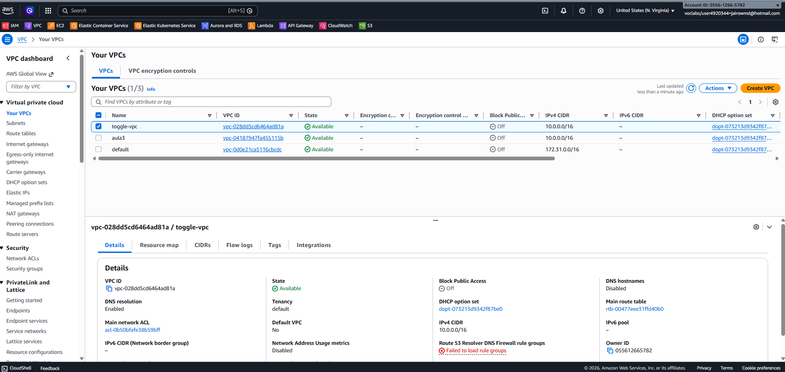

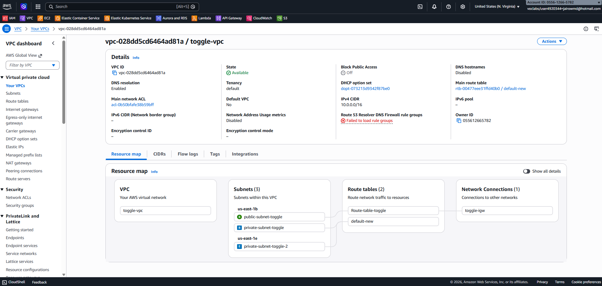

---

# 2. Criação das Subnets

## Public Subnet

| Parâmetro | Valor |
|------------|---------|
| Nome | public-subnet-toggle |
| CIDR | 10.0.1.0/24 |

### Configuração Adicional

Habilitar:

- Auto Assign Public IPv4 Address

---

## Private Subnet 1

| Parâmetro | Valor |
|------------|---------|
| Nome | private-subnet-toggle |
| CIDR | 10.0.2.0/24 |

---

## Private Subnet 2

| Parâmetro | Valor |
|------------|---------|
| Nome | private-subnet-toggle-2 |
| CIDR | 10.0.3.0/24 |

### Evidência

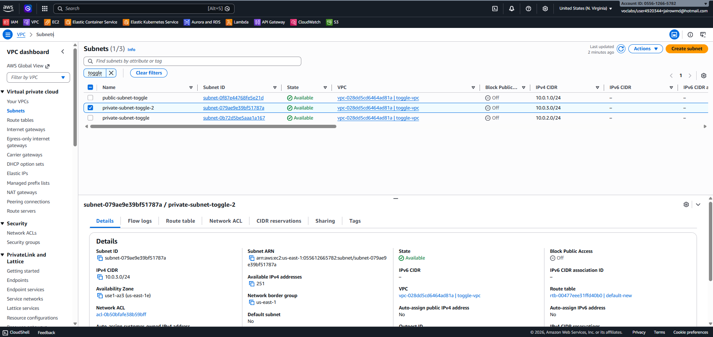

---

# 3. Internet Gateway

## Configuração

| Parâmetro | Valor |
|------------|---------|
| Nome | toggle-igw |

O Internet Gateway foi associado à VPC para permitir comunicação com a Internet.

### Evidência

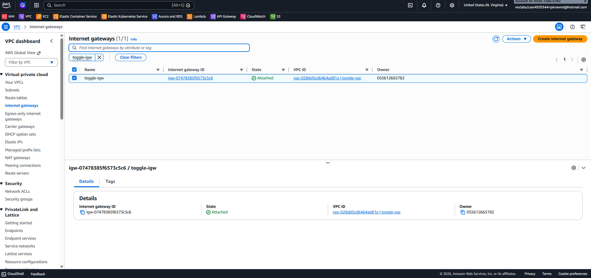

---

# 4. Route Table

## Configuração

### Rota Pública

| Destino | Target |
|----------|----------|
| 0.0.0.0/0 | Internet Gateway |

A Route Table foi associada à Public Subnet.

### Evidência

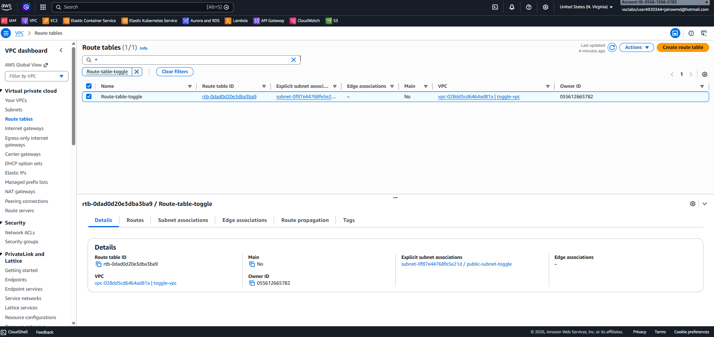
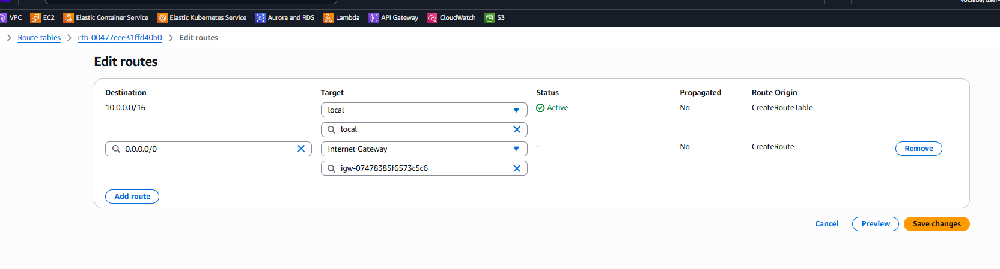

---

# 5. Security Groups

## Security Group da EC2

### Regras de Entrada

| Porta | Origem |
|---------|---------|
| 22 (SSH) | Meu IP |
| 80 (HTTP) | 0.0.0.0/0 |
| 5000 (Aplicação) | 0.0.0.0/0 |

---

## Security Group do RDS

### Regras de Entrada

| Porta | Origem |
|---------|---------|
| 5432 (PostgreSQL) | Security Group da EC2 |

### Evidência

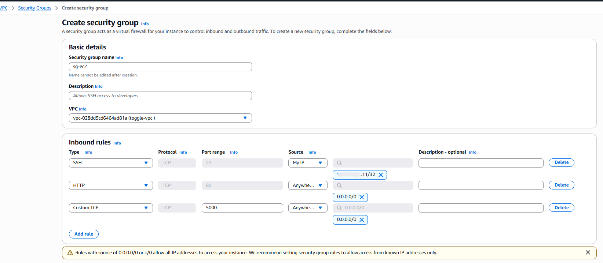

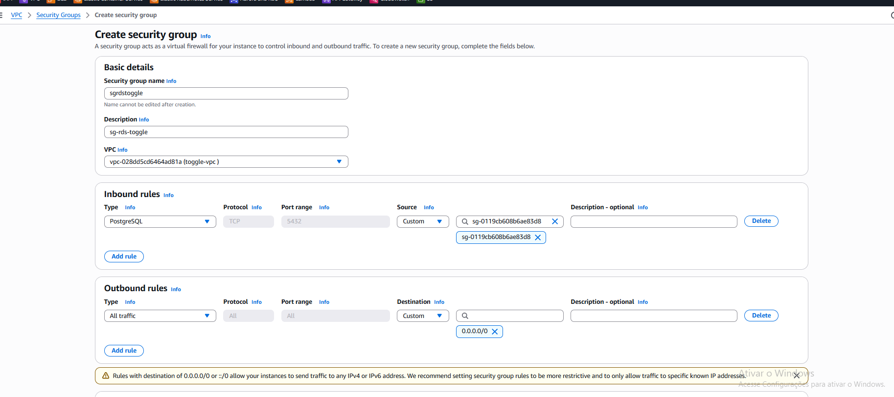

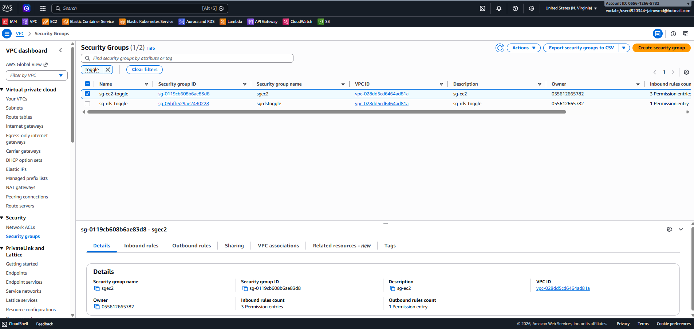
---

# 6. Criação da EC2

## Configuração

| Parâmetro | Valor |
|------------|---------|
| Nome | toggle-ec2 |
| Tipo | t3.micro |
| Sistema Operacional | Ubuntu |

### Rede

- VPC: toggle-vpc
- Public Subnet
- Public IP habilitado

### Evidência

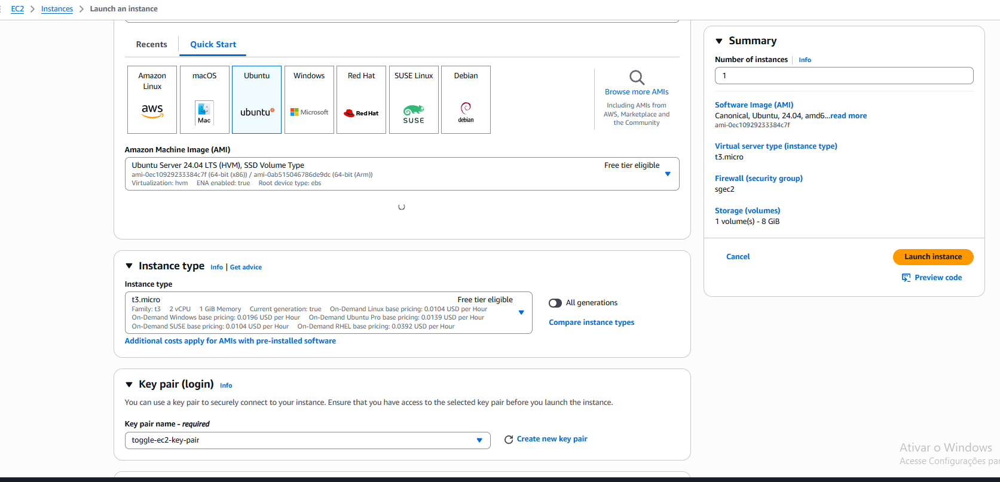

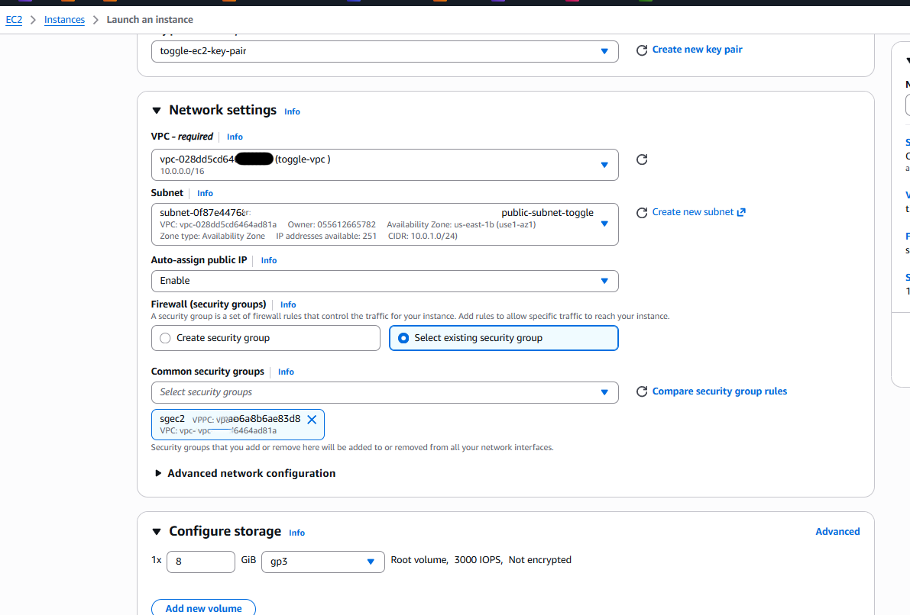

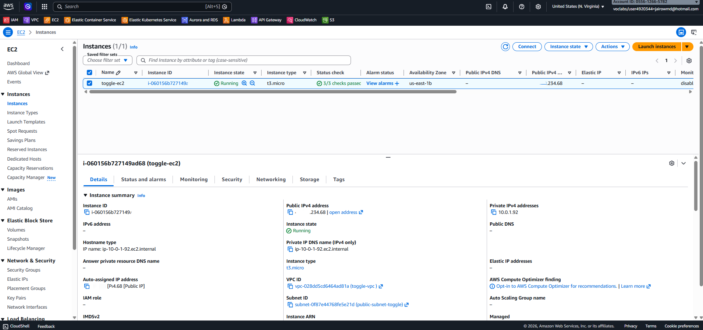
---

# 7. Criação do Banco de Dados RDS

## Configuração

| Parâmetro | Valor |
|------------|---------|
| Engine | PostgreSQL |
| Classe | db.t4g.micro |
| Banco | postgres |
| Identifier | toggle-db |

### Rede

- VPC dedicada
- Private Subnets
- Public Access: Disabled

### Evidência

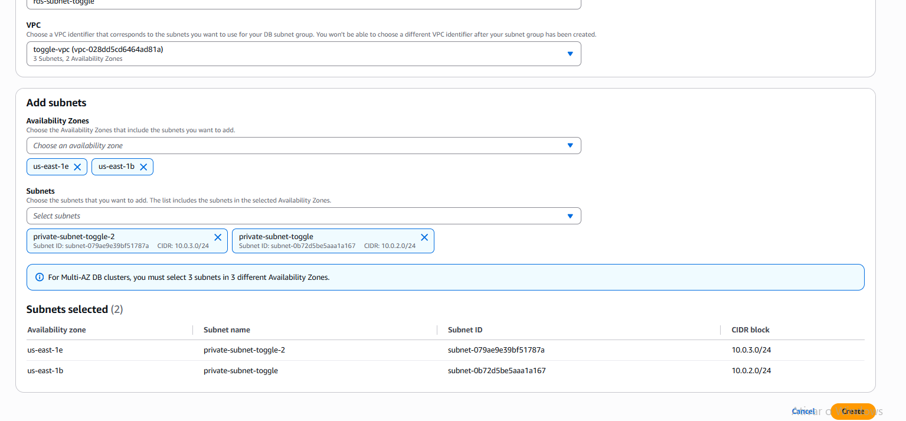

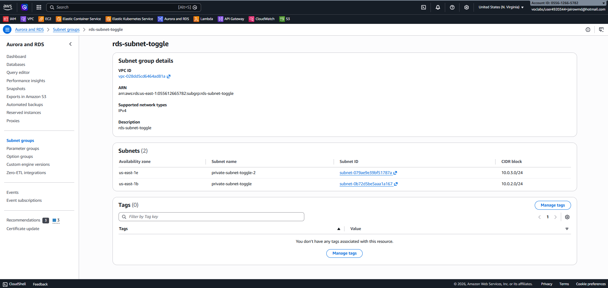

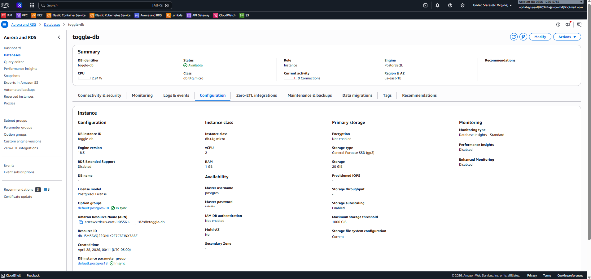
---

# 8. Endpoint do Banco

Exemplo:

```bash
toggle-db.xxxxx.us-east-1.rds.amazonaws.com
```

---

# 9. Acesso à EC2

```bash
ssh -i chave.pem ubuntu@IP-DA-EC2
```

---

# 10. Instalação das Dependências

```bash
sudo apt update
sudo apt install python3-pip git -y
```

---

# 11. Deploy da Aplicação

## Clonar Repositório

```bash
git clone https://github.com/dougls/toggle-master-monolith.git
cd toggle-master-monolith
```

## Criar Ambiente Virtual

```bash
sudo apt install python3-venv -y

python3 -m venv venv

source venv/bin/activate
```

## Instalar Dependências

```bash
pip install -r requirements.txt
```

Caso necessário:

```bash
sudo apt install libpq-dev python3-dev -y
```

---

# 12. Configuração da Conexão com o Banco

```bash
DB_HOST=toggle-db.xxxxx.us-east-1.rds.amazonaws.com \
DB_NAME=postgres \
DB_USER=postgres \
DB_PASSWORD=senha \
flask --app app.py init-db
```

---

# 13. Executar Aplicação

```bash
python app.py
```

---

# 14. Testes

## Inicialização do Banco

```bash
flask --app app.py init-db
```

Resultado esperado:

```text
Tabela 'flags' inicializada com sucesso.
```

---

## Criação de Feature Flag

```bash
curl -X POST http://IP-DA-EC2:5000/flags \
-H "Content-Type: application/json" \
-d '{"name":"teste","enabled":true}'
```

Resposta:

```json
{
  "message": "Flag 'teste' criada com sucesso"
}
```
### Evidências

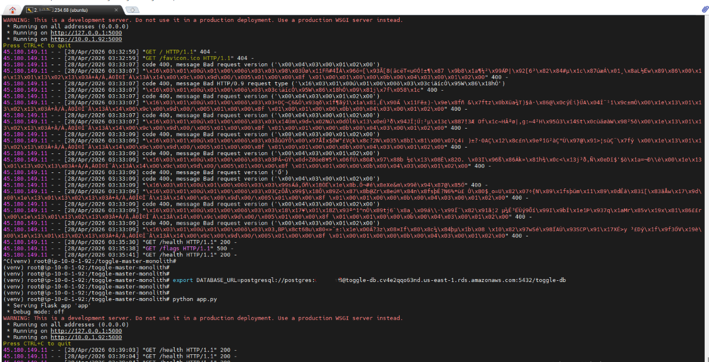


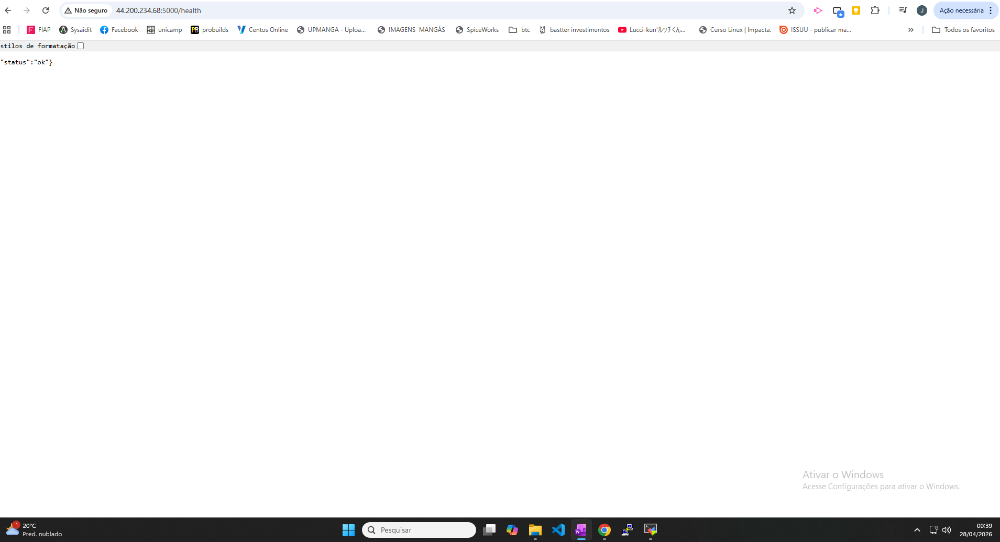

---

# Problemas Encontrados

Durante a implementação foram identificados alguns desafios:

- Configuração inicial da VPC.
- Necessidade de múltiplas Availability Zones para o RDS.
- Configuração das variáveis de ambiente.
- Conectividade EC2 ↔ PostgreSQL.
- Diferença entre DB Identifier e Database Name.

Todos os problemas foram solucionados através de ajustes de infraestrutura e configuração.

---

# Boas Práticas Aplicadas

- Separação entre camada de aplicação e banco.
- Banco de dados sem acesso público.
- Variáveis de ambiente para configuração.
- Uso de Security Groups restritivos.
- Subnets privadas para o RDS.
- Isolamento através de VPC dedicada.

---
